# GreenWave Carbon

> 기업의 탄소 배출 현황을 시각화하고, 예상 탄소 비용 및 감축 시나리오를 분석할 수 있는 탄소 배출 대시보드

---

## 프로젝트 소개

GreenWave Carbon은 기업 임원 및 탄소 관리 담당자가 탄소 배출 현황을 빠르게 파악하고,
향후 발생 가능한 탄소 비용과 감축 전략을 계획할 수 있도록 설계한 웹 기반 대시보드입니다.

단순히 배출량 숫자를 나열하는 화면이 아니라, 아래 질문에 순서대로 답할 수 있도록 정보 구조를 설계했습니다.

```
현황 파악 → 원인 분석 → 비용 영향 → 심층 탐색 → 공시 확인
```

1. 현재 우리 기업의 총 탄소 배출 규모는 어느 정도인가?
2. 어떤 배출원(Source)이 가장 큰 영향을 주고 있는가?
3. 현재 기준 예상 탄소 비용은 얼마인가?
4. 기업·산업·Scope별로 더 자세히 들여다보려면?
5. 감축 목표를 적용했을 때 비용 절감 효과는 어느 정도인가?

---

## UI 미리보기

### 대시보드

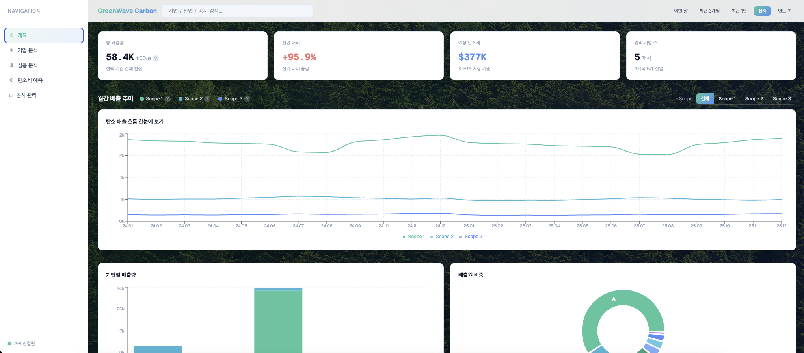
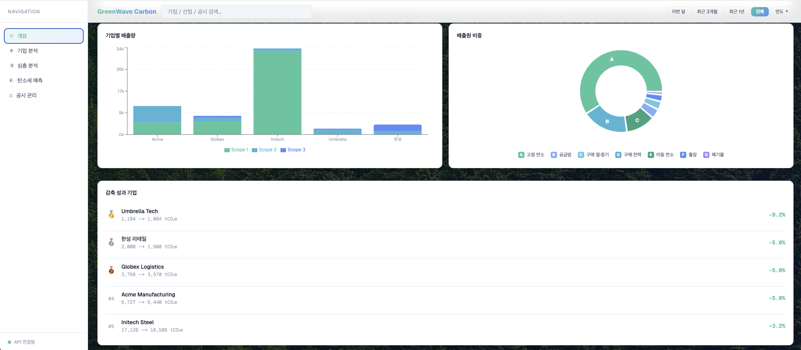
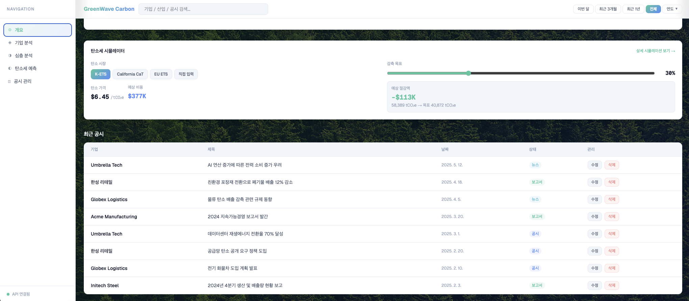

### 기업 분석

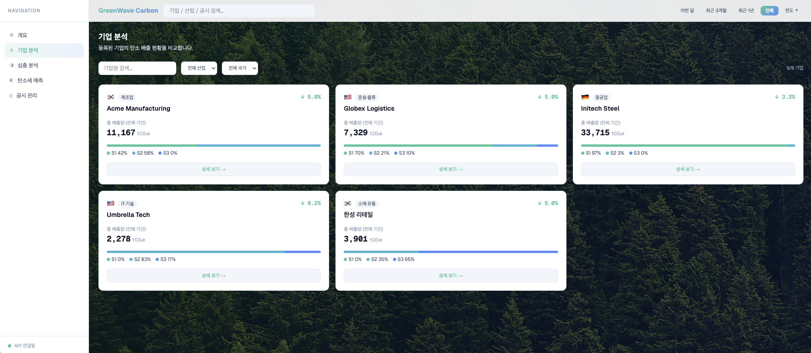
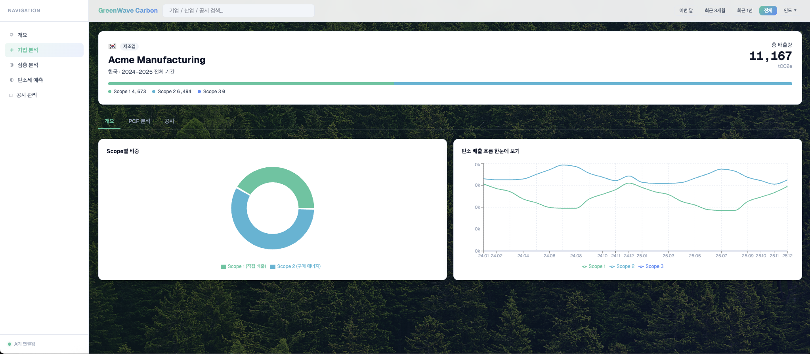

### 심층 분석

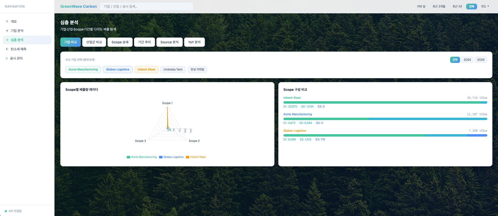

### 탄소세 시뮬레이터

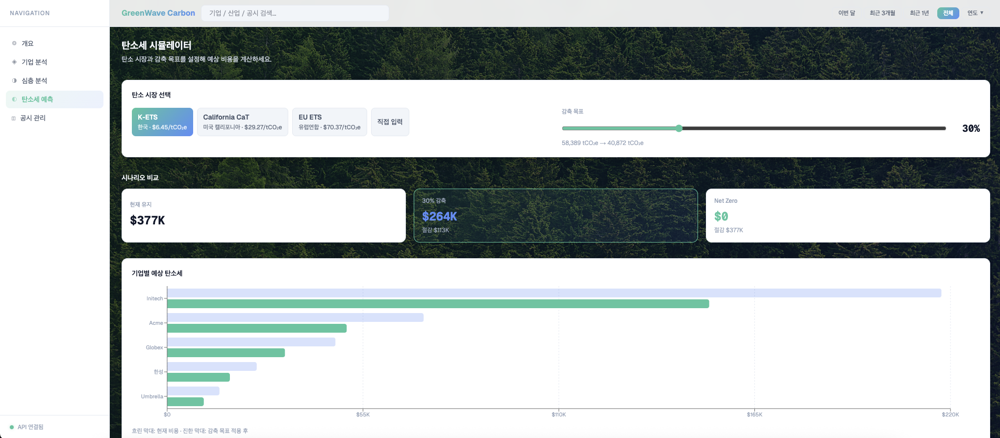

### 공시 관리

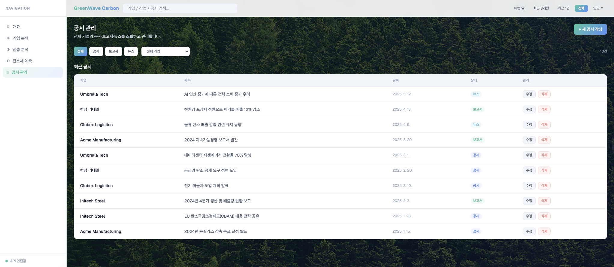

### 데모 영상

**대시보드**


**기업 분석**

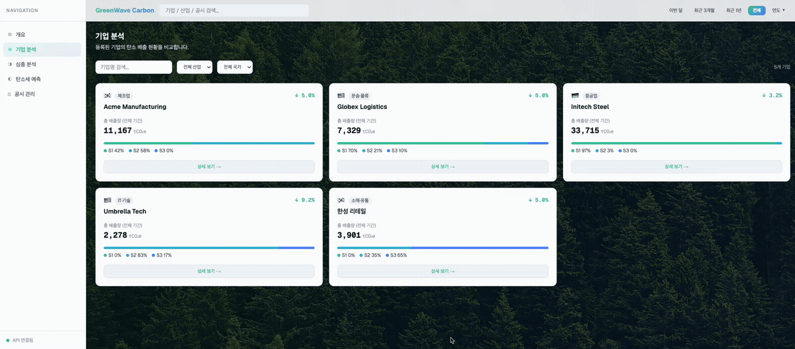

**심층 분석**


**탄소세 시뮬레이터**

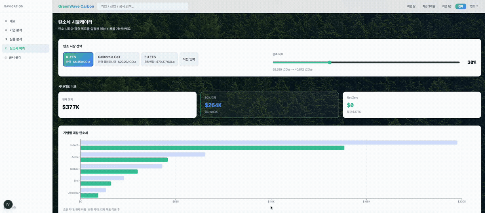

**공시 관리**

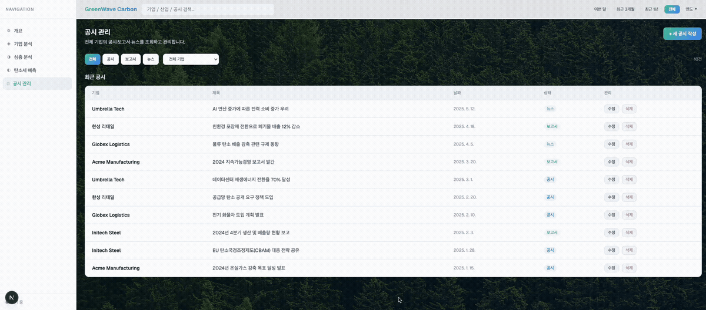

---

## 주요 기능

### 대시보드 (`/`)

- 총 배출량 / 전기 대비 변화율 / 예상 탄소세 / 관리 기업 수 요약 카드
- 기간 필터 (이번 달 / 최근 3개월 / 최근 1년 / 전체 / 연도별)
- Scope별 월간 배출 추이 라인 차트 + ScopeLegend 범례
- 기업별 배출량 비교 바 차트
- 배출원(Source) 비중 분석 도넛 차트
- 기업 감축 성과 랭킹 (YoY 기준)
- 탄소세 시뮬레이터 위젯 (인라인)
- 최근 공시 목록 (수정 · 삭제)

### 기업 상세 (`/companies`)

- 기업 목록 + 클릭 시 상세 페이지
- Scope별 배출 비중 도넛 차트
- 24개월 배출 트렌드 (YoY 비교 라인 차트)
- PCF 전과정 폭포 차트 (원자재 → 제조 → 운송 → 사용 → 폐기)
- 기업 공시 수정 · 삭제

### 심층 분석 (`/analysis`)

6개 탭으로 구성된 다각도 배출 탐색 페이지입니다.

| 탭 | 내용 |
|----|------|
| 기업 비교 | 최대 5개사 RadarChart + Scope 스택 바 비교 |
| 산업군 비교 | 산업별 그룹 스택 바 + 산업 상세 카드 |
| Scope 상세 | Scope 클릭 → 해당 배출원 수평 바 드릴다운 |
| 기간 추이 | 기업·연도 선택 가능한 월별 라인 차트 |
| Source 분석 | 기업·Scope 필터 기반 수평 진행 바 |
| YoY 분석 | 연간 요약 카드 + 2024/2025 그룹 바 + 월별 증감률 그리드 |

### 탄소세 시뮬레이터 (`/simulator`)

- 탄소 시장 프리셋 선택 (K-ETS / EU ETS / California CaT / 직접 입력)
- 감축 목표 슬라이더 기반 예상 절감 비용 계산
- 현재 유지 / 30% 감축 / Net Zero 시나리오 비교
- 기업별 예상 탄소세 수평 바 차트

### 공시 관리 (`/posts`)

- 전체 기업 공시 목록 (카테고리 + 기업 필터)
- 새 공시 작성 모달
- 수정 (모달 기반 인라인 에러 + 재시도) / 삭제 (즉시 반영)
- 저장 중 · 완료 · 오류 · 재시도 상태 처리
- Optimistic update + 실패 시 rollback

---

## 기술 스택

| 기술 | 버전 | 선택 이유 |
|------|------|-----------|
| Next.js (App Router) | 16 | 서버 컴포넌트 + API Route 일체형 구조 |
| TypeScript | 5 | 타입 안정성 및 도메인 모델 명시 |
| Tailwind CSS | v4 | CSS 변수 기반 디자인 토큰 관리 |
| Zustand | v5 | 최소한의 보일러플레이트로 도메인별 스토어 분리 |
| SWR | — | 로딩/에러/재시도 상태와 캐시 무효화 일관 처리 |
| Recharts | v3 | React 친화적 선언형 차트 라이브러리 |
| Prisma + Supabase | v7 | 타입 안전 ORM + PostgreSQL 관계형 데이터 관리 |

---

## 아키텍처 개요

```
Supabase (PostgreSQL)
    ↕ Prisma ORM (타입 안전 쿼리)
app/api/           ← Next.js API Route (서버 컴포넌트)
    ↕ fetch (SWR)
lib/api.ts         ← 클라이언트 fetcher + mayFail() 실패 시뮬레이션
    ↕
Zustand Store      ← 전역 상태 (필터·탄소세·UI)
    ↕
Components         ← SWR 데이터 + Zustand 상태 조합해 렌더링
```

### 데이터 흐름 상세

1. **읽기**: `SWR("companies", fetchCompanies)` → `/api/companies` → Prisma → Supabase  
   응답은 SWR 캐시에 보관되고, 필터 변경 시에는 캐시된 데이터를 `lib/utils/dashboard.ts`의 순수 함수로 재가공합니다. 서버 재요청 없이 빠르게 반응합니다.

2. **쓰기**: `mayFail()` 확률 실패 → 통과 시 `fetch("/api/posts", { method: "POST" })` → Prisma → Supabase  
   실패는 DB를 건드리기 전에 throw되므로 데이터 불일치가 없습니다.

3. **상태 동기화**: 쓰기 성공 후 `mutate("posts")`로 SWR 캐시를 무효화해 최신 상태를 재조회합니다.

---

## 상태 관리 (Zustand 스토어)

스토어를 도메인별로 3개로 분리했습니다. 모든 차트·카드는 스토어 값을 구독해 동기화됩니다.

### `filterStore`

```
scope: GhgScope | "all"   ← Scope 필터 (1/2/3/전체)
period: Period             ← 기간 필터 (이번 달/3개월/1년/전체/연도)
```

Header의 기간 버튼과 ScopeTrendChart의 Scope 토글이 이 스토어를 공유합니다.  
두 컴포넌트가 직접 소통하지 않고 스토어를 통해 동기화되므로, 어느 페이지에서 변경해도 전체에 반영됩니다.

### `taxStore`

```
selectedMarketId: MarketId   ← K-ETS / EU ETS / CA-CAP / custom
carbonPrice: number          ← USD/tCO₂e (프리셋 선택 시 자동 반영)
targetReductionRate: number  ← 0~1 (감축 목표)
```

대시보드 인라인 위젯과 `/simulator` 상세 페이지가 같은 스토어를 구독합니다.  
한 곳에서 탄소 가격을 바꾸면 요약 카드의 예상 세금도 즉시 갱신됩니다.

### `uiStore`

```
sidebarOpen: boolean           ← 모바일 사이드바 열림/닫힘
dataStatus: "idle" | "loading" | "error" | "connected"
```

`DashboardContent`의 SWR 로딩 상태를 `uiStore.dataStatus`에 반영하면,  
사이드바 하단 인디케이터가 API 연결 상태를 실시간으로 표시합니다.

---

## Fake Backend 실패 시뮬레이션

과제 요구사항인 쓰기 실패·재시도 흐름을 검증하기 위해 `lib/api.ts`에 구현했습니다.

```typescript
const WRITE_FAILURE_RATE = 0.15; // 15% 확률로 실패

function mayFail() {
  if (Math.random() < WRITE_FAILURE_RATE)
    throw new Error("서버 오류가 발생했습니다. 잠시 후 다시 시도해주세요.");
}

// 모든 쓰기 함수 진입 시 mayFail() 먼저 호출
export async function createPost(...) { mayFail(); /* ... */ }
export async function updatePost(...) { mayFail(); /* ... */ }
export async function deletePost(...) { mayFail(); /* ... */ }
```

`mayFail()`은 실제 `fetch`를 호출하기 **전**에 throw하므로 DB에는 영향이 없습니다.  
클라이언트는 catch 블록에서 오류 메시지를 모달 내에 표시하고 재시도 버튼을 활성화합니다.

---

## 디자인 시스템

### 컬러 팔레트

| 역할 | CSS 변수 | 색상 |
|------|----------|------|
| 포인트 시작 (초록) | `--grad-start` | `#43c59e` |
| 포인트 끝 (파랑) | `--grad-end` | `#4f8ef7` |
| 카드 배경 | `--bg-card` | `#ffffff` |
| 본문 텍스트 | `--text-primary` | `#0f172a` |
| 보조 텍스트 | `--text-secondary` | `#475569` |
| 비활성 | `--text-muted` | `#94a3b8` |

포인트 그라데이션: `linear-gradient(135deg, #43c59e 0%, #4f8ef7 100%)`

- 초록: 감축·자연 → Scope 1
- 파랑: 데이터·기술 → Scope 3

Scope 1 → 2 → 3 순서가 초록 → 청록 → 파랑 흐름으로 자연스럽게 연결됩니다.

### Scope 색상

| Scope | 색상 |
|-------|------|
| Scope 1 — 직접 배출 | `#43c59e` |
| Scope 2 — 구매 에너지 | `#3ab5d4` |
| Scope 3 — 가치사슬 | `#4f8ef7` |

### 레이아웃

```
+------------------------------------------------------------------+
| Header (sticky + backdrop-blur)                                  |
| GreenWave Carbon  [검색]  [이번달][3개월][1년][전체][2024]       |
+----------------+--------------------------------------------------+
| Sidebar        |                                                  |
| w-56 (고정)    |  [총 배출량] [기간 대비] [탄소세] [기업 수]     |
|                |                                                  |
|  개요          |  월간 배출 추이  --  Scope1 Scope2 Scope3       |
|  기업 분석     |                                                  |
|  심층 분석     |  기업별 배출량     |  배출원 비중               |
|  탄소세 예측   |                                                  |
|  공시 관리     |  기업 감축 성과 랭킹                            |
|                |                                                  |
|  o API 연결됨  |  탄소세 시뮬레이터 위젯                         |
+----------------+--------------------------------------------------+
```

반응형:
- 데스크탑(`lg`): 사이드바 고정 (`lg:pl-56`)
- 모바일: 햄버거 버튼 → Drawer + 배경 오버레이

### CSS 변수 상속 트릭

배경 이미지(다크) 위의 흰 카드에서 텍스트 색상을 별도 props 없이 처리하기 위해  
CSS 변수 상속(inheritance)을 활용했습니다.

```css
/* .main-bg 범위에서 카드·헤더의 텍스트 변수를 다크 계열로 오버라이드 */
.main-bg [style*="--bg-card"],
.main-bg header {
  --text-primary:   #0f172a;
  --text-secondary: #475569;
  --text-muted:     #94a3b8;
  --border-subtle:  #e2e8f0;
}
```

Card 컴포넌트는 `style="background: var(--bg-card)"` 를 렌더링하므로  
`[style*="--bg-card"]` 선택자가 카드 컴포넌트만 정확히 선택합니다.  
이 방식 덕분에 어두운 배경과 흰 카드가 공존해도 컴포넌트 코드 변경이 불필요합니다.

---

## 타이포그래피

| 용도 | 폰트 |
|------|------|
| 본문·UI | Geist Sans |
| 숫자·데이터 | Geist Mono |

---

## UX 개선 — 비전문가 접근성

탄소 전문 용어를 처음 접하는 사용자를 위해 두 컴포넌트를 추가했습니다.

### `InfoTooltip`

`tCO₂e`, `YoY` 같은 전문 용어 옆에 `?` 아이콘을 배치합니다.  
호버 시 용어 설명이 작은 말풍선으로 표시됩니다.

```tsx
<InfoTooltip text="이산화탄소 환산톤 — 온실가스를 CO₂ 기준으로 환산한 단위" />
```

### `ScopeLegend`

월간 배출 추이 차트 헤더에 Scope 1/2/3 범례를 인라인으로 표시합니다.  
각 항목에도 InfoTooltip이 달려 있어 차트를 보는 즉시 의미를 확인할 수 있습니다.

---

## 가정 및 설계 결정

### 데이터 모델 확장

과제 기본 모델에 아래를 추가했습니다.

**`Country.defaultCarbonPrice`**  
국가별 탄소 시장 가격이 실제로 다르기 때문에 추가했습니다.  
K-ETS($6.45) vs EU ETS($70.37) 같은 현실적인 차이를 시뮬레이터에 반영합니다.  
출처: World Bank Carbon Pricing Dashboard 2025

**`Company.industry`**  
산업마다 Scope 비중이 다르기 때문에 추가했습니다.  
IT 기업 → Scope 2 중심, 물류 기업 → Scope 1 중심 등 산업군별 벤치마크 비교에 필요합니다.

**`Post.category`** (`announcement` / `report` / `news`)  
공시, 보고서, 뉴스를 구분해 경영진이 필요한 정보만 필터링할 수 있도록 추가했습니다.

---

### 배출원(Source) 중심 분석

배출 비중 도넛 차트를 Scope 1/2/3 대신 실제 배출원(Source) 기준으로 구성했습니다.

Scope 분류는 "얼마나 책임이 있는가"를 묻는 분류이고,  
배출원 분류는 "무엇을 줄여야 하는가"를 바로 보여주는 분류입니다.

경영진 입장에서 "구매 전력에서 가장 많이 나온다 → 재생에너지 계약을 검토하자"처럼  
행동 가능한 인사이트를 더 직접적으로 제공합니다.

---

### 공시 수정 UX — 인라인 편집 vs 모달

모달 기반 수정을 선택했습니다.

인라인 편집은 테이블 행이 입력 필드로 바뀌면서 레이아웃이 흔들리고,  
로딩·에러·재시도 상태를 행 내부에서 처리하기 복잡해집니다.

모달은 수정 상태를 독립적인 레이어에서 관리하므로  
Fake Backend의 실패 → 인라인 에러 메시지 → 재시도 흐름을 명확하게 표현할 수 있습니다.

---

### 기간 필터 구조

헤더에 상대 기간 버튼과 연도 드롭다운을 분리했습니다.

상대 기간 버튼만 두면 연도가 늘어날수록 버튼이 증가합니다.  
연도 드롭다운을 분리하면 새 연도 데이터가 추가될 때 드롭다운 옵션만 늘어나고  
버튼 수는 그대로 유지됩니다.

---

### SWR fetcher key 패턴

SWR은 캐시 키를 fetcher의 첫 번째 인자로 전달합니다.  
`useSWR("posts", fetchPostsFromStore)` 로 쓰면  
`fetchPostsFromStore("posts")`가 호출되어 `companyId="posts"`로 필터링됩니다.

이 문제를 방지하기 위해 인자가 필요 없는 전체 조회는  
`useSWR("posts", () => fetchPostsFromStore())` 형태로 arrow function으로 감쌉니다.

---

## 목 데이터 구성

### 기업

| 기업 | 산업 | 국가 | 주요 Scope |
|------|------|------|-----------|
| Acme Manufacturing | 제조업 | 🇰🇷 한국 | Scope 1, 2 |
| Globex Logistics | 운송·물류 | 🇺🇸 미국 | Scope 1, 3 |
| Initech Steel | 중공업 | 🇩🇪 독일 | Scope 1 중심 |
| Umbrella Tech | IT·기술 | 🇺🇸 미국 | Scope 2 중심 |
| Hansung Retail | 소매·유통 | 🇰🇷 한국 | Scope 3 중심 |

### 데이터 리얼리티

- **기간**: 2024 ~ 2025년 (24개월) — YoY 비교가 가능하도록
- **계절 패턴**: 제조업 겨울 난방 증가, 유통업 Q4 시즌 증가 등 실제 패턴 반영
- **감축률 차등**: IT(10%) > 기본(5%) > 철강(3%) — 산업별 감축 난이도 차이 반영

---

## 실행 방법

### 환경 변수 설정

```bash
# .env.local
DATABASE_URL="postgresql://..."  # Supabase 연결 문자열
DIRECT_URL="postgresql://..."    # Prisma migrations용 direct URL
```

### 개발 서버 실행

```bash
npm install
npm run dev
```

### DB 시드 (처음 세팅 시)

```bash
npm run db:seed
```

---

## 프로젝트 구조

```
├── app/
│   ├── api/
│   │   ├── companies/         # GET /api/companies, /api/companies/[id]
│   │   └── posts/             # GET/POST /api/posts, PUT/DELETE /api/posts/[id]
│   ├── analysis/              # 심층 분석 페이지 (/analysis)
│   ├── companies/             # 기업 분석 페이지 (/companies)
│   ├── posts/                 # 공시 관리 페이지 (/posts)
│   ├── simulator/             # 탄소세 시뮬레이터 (/simulator)
│   └── page.tsx               # 대시보드 (/)
├── components/
│   ├── analysis/              # AnalysisContent (6탭)
│   ├── company/               # 기업 상세 컴포넌트
│   ├── dashboard/             # 대시보드 구성 컴포넌트
│   ├── layout/                # Header, Sidebar
│   ├── simulator/             # 탄소세 시뮬레이터 컴포넌트
│   └── ui/                    # Card, InfoTooltip, ScopeLegend
├── lib/
│   ├── api.ts                 # 클라이언트 fetcher + mayFail() 실패 시뮬레이션
│   ├── prisma.ts              # Prisma 클라이언트 싱글턴
│   ├── data/                  # 정적 데이터 (markets, countries, sources)
│   └── utils/dashboard.ts     # 차트 데이터 가공 순수 함수
├── prisma/
│   ├── schema.prisma          # DB 스키마
│   └── seed.ts                # 시드 데이터
├── store/
│   ├── filterStore.ts         # Scope·기간 필터
│   ├── taxStore.ts            # 탄소 시장·가격·감축률
│   └── uiStore.ts             # 사이드바·API 연결 상태
└── types/index.ts             # 공통 TypeScript 타입
```

---

## AI 활용 방식

이번 과제에서는 Claude Code(Anthropic CLI)를 활용했습니다.

### 주요 활용 영역

- 대시보드 정보 구조(IA) 및 탭 구성 탐색
- 복잡한 Recharts 조합 (RadarChart + 스택 바 혼합) 구현
- Prisma + Supabase 연동 설정 (SSL Pool 설정, Next.js 16 async params 처리)
- CSS 변수 상속을 활용한 다크 배경 + 흰 카드 구조 설계
- README 문서 구조화

### AI 제안을 수정하거나 채택하지 않은 사례

**기업 목록 사이드바 배치 → 제거**  
초기에 사이드바에 기업 목록을 두는 구조를 검토했지만,  
관리 툴 느낌이 강해지고 모바일에서 공간이 부족해 별도 `/companies` 페이지로 분리했습니다.

**차트 내 배출원별 색상 (`<rect>` 삽입) → 단색으로 변경**  
Recharts `<Bar>` 내부에 `<rect>`를 삽입해 배출원별 색상을 주려 했지만  
Recharts 렌더링 구조상 동작하지 않아, Scope별 고정 색상을 `fill` prop으로 전달하는 방식으로 단순화했습니다.

**glassmorphism 반투명 카드 → 불투명 흰 카드**  
배경 이미지와 결합 시 텍스트 가독성이 떨어져 흰 불투명 카드로 변경했습니다.

### 의사결정 기준

AI 제안을 그대로 적용하지 않고, 과제 요구사항 · 가독성 · 유지보수성 기준으로  
직접 검토 후 채택 여부를 판단했습니다.

---

## 과제 수행 시간

약 8시간

---

## 향후 개선 사항

- 실시간 데이터 스트리밍 (WebSocket)
- PDF 리포트 export
- 국제 탄소 가격 API 연동
- 다크 모드
- E2E 테스트 (Playwright)
